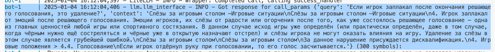
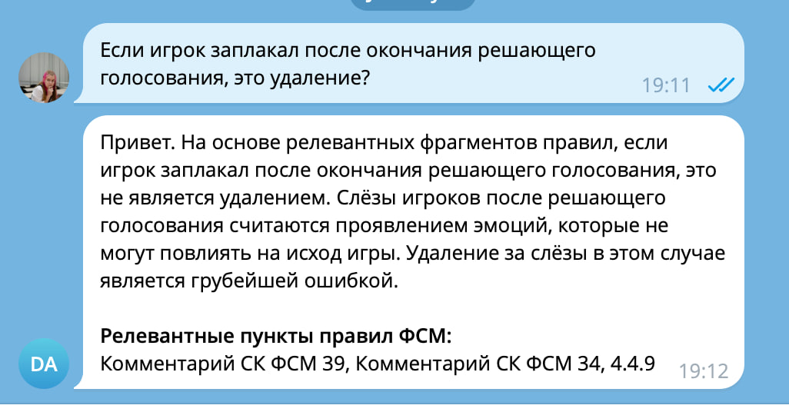
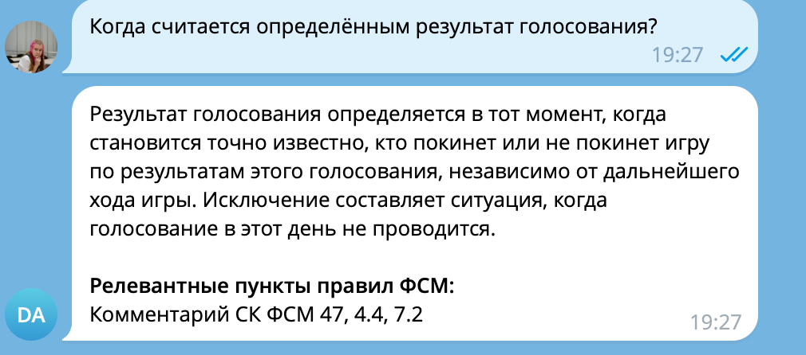
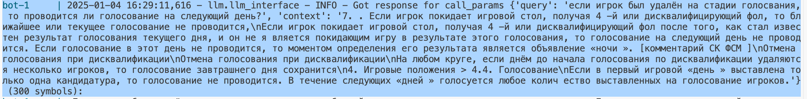
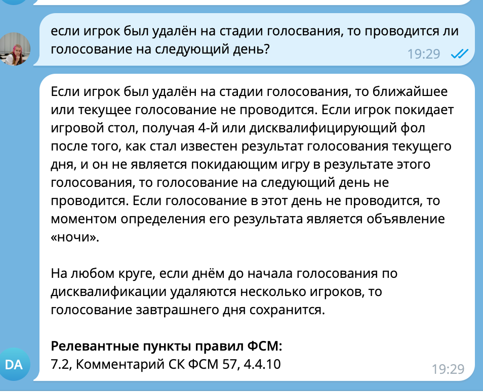

# Описание проекта
Это ассистент по турнирным правилам интеллектуальный игры "Спортивная Мафия" для игроков и судей. 

# Как запустить проект с нуля
## Заполнение .env
### Chroma DB
Скопируйте файл `.env.example` в `.env` и заполните его значениями.
- Хрома ожидает ваш пароль в зашифрованном виде. Получить его можно командой `docker run --rm --entrypoint htpasswd httpd:2 -Bbn admin YOUR_PASSWORD > server.htpasswd`. Оригинальный пароль укажите в переменной `CHROMA_PASSWORD`. Выходной файл укажите в переменной `CHROMA_SERVER_AUTHN_CREDENTIALS_FILE`.
- Остальные переменные можно оставить по умолчанию.

### Embeddings
- Для векторизации фрагментов используется `"intfloat/multilingual-e5-large"`, она вполне достойно работает и без гпу. Однако вы можете указать любую модель. Не забудьте изменить `EMBEDDING_DIMENSION`, если используете другую модель.

### Telegram
- Для запуска бота вам нужно создать бота через @BotFather и вставить токен в переменную `TELEGRAM_BOT_TOKEN`.

### LLM Api
- По умолчанию используется бесплатный апи к модели mistral.
- Чтобы использовать LLM в качестве генератора ответов, вам нужно указать апи ключ при наличии – `LLM_API_KEY`. К модели mistral можно получить ключ на сайте https://console.mistral.ai/.
- `LLM_BASE_URL` – базовый url для запросов к апи, можно указывать localhost, runpod, openai и тд.
- `LLM_MODEL_NAME` – название модели, которую вы хотите использовать. 

### Data path
- Эти переменные можно не менять, в репозитории представлены файлы с данными по умолчанию.
- `DATA_COMMENTS` – путь к файлу с комментариями к правилам.
- `DATA_OFFICIAL_RULES` – путь к файлу с официальными правилами.

## Запуск докер контейнеров
После заполнения .env файлов вы можете запустить связку телеграм-бот + chroma база данных командой `docker-compose up -d`.

## Заполнение базы данных
Для того, чтоб наполнить базу данных правилами, вам нужно запустить скрипт `python src/database/init_rag_new.py`. Если вы не меняли пути в .env файле, то скрипт загрузит правила и комментарии из папки `data/` в репозитории.

# Несколько примеров валидации RAG
## Пример 1

## Пример 2

## Пример 3

# Детали реализации
- Докер сервис с базой данный и телеграм-ботом
- Использование ChromaDB для хранения фрагментов правил
- Использование мультиязычного векторайзера intfloat/multilingual-e5-large для векторизации фрагментов вместо дефолтного, который не очень хорошо работает с русским языком
- Интеграция LLM через litellm, что позволяет использовать любого популярного LLM провайдера, меняя его на лету, без изменения кода
- Подключение Mistral AI – бесплатную мультиязычную модель
